# production-ready-MLOps-on-GCP


## Overview

This repository offers a reference implementation for building a production-ready MLOps solution on Google Cloud using [Vertex Pipelines](https://cloud.google.com/vertex-ai/docs/pipelines/).
It serves as a foundational template for implementing your own machine learning projects. The setup includes:

* **Infrastructure-as-Code** : Employs Terraform to establish a standard dev/test/prod environment with Vertex AI and other services.
* **ML training and prediction pipelines** using the Kubeflow Pipelines
* **Reusable Kubeflow components** : Crafted for use in a variety of ML pipelines.
* **CI/CD** : Utilizes Google Cloud Build for linting, testing, and deploying ML pipelines.
* **Developer scripts** : Comprising a Makefile and Python scripts etc. to streamline development.


## Cloud Architecture

This setup utilizes four distinct Google Cloud projects:

* `dev`: A shared sandbox environment dedicated to development.
* `test`: A testing environment where new changes are validated before being moved to production. This environment should closely mirror the production setup.
* `prod`: The production environment.
* `admin`: A separate project used to configure CI/CD in Cloud Build, as these pipelines manage deployments across all other environments.

### Architecture Diagram

```mermaid
graph TB
    subgraph "GitHub Repository"
        Code[Code Repository]
        PR[Pull Requests]
        Release[Git Tags/Releases]
    end

    subgraph "GCP Admin Project - CI/CD"
        CB[Cloud Build]
        CB_PR[PR Checks Trigger]
        CB_E2E[E2E Test Trigger]
        CB_TF_Plan[Terraform Plan Trigger]
        CB_TF_Apply[Terraform Apply Trigger]
        CB_Release[Release Trigger]
        CB_Schedule[Schedule Trigger]
    end

    subgraph "GCP Dev Project"
        Dev_AR[Artifact Registry]
        Dev_Vertex[Vertex AI Pipelines]
        Dev_BQ[BigQuery]
        Dev_GCS[Cloud Storage]
        Dev_Registry[Model Registry]
    end

    subgraph "GCP Test Project"
        Test_AR[Artifact Registry]
        Test_Vertex[Vertex AI Pipelines]
        Test_BQ[BigQuery]
        Test_GCS[Cloud Storage]
        Test_Registry[Model Registry]
    end

    subgraph "GCP Prod Project"
        Prod_AR[Artifact Registry]
        Prod_Vertex[Vertex AI Pipelines]
        Prod_BQ[BigQuery]
        Prod_GCS[Cloud Storage]
        Prod_Registry[Model Registry]
        Prod_CRF[Cloud Run Function]
        Prod_PubSub[Pub/Sub]
    end

    Code --> PR
    PR --> CB_PR
    PR --> CB_TF_Plan
    PR --> CB_E2E
    Code --> Release
    Release --> CB_Release

    CB_PR --> |Pre-commit checks| CB
    CB_E2E --> |Run E2E tests| Dev_Vertex
    CB_TF_Plan --> |Plan infrastructure| CB
    CB_TF_Apply --> |Deploy infrastructure| Dev_AR
    CB_TF_Apply --> |Deploy infrastructure| Test_AR
    CB_TF_Apply --> |Deploy infrastructure| Prod_AR

    CB_Release --> |Build & push images| Dev_AR
    CB_Release --> |Build & push images| Test_AR
    CB_Release --> |Build & push images| Prod_AR

    CB_Schedule --> |Create schedules| Test_Vertex
    CB_Schedule --> |Create schedules| Prod_Vertex

    Prod_CRF --> |Trigger pipelines| Prod_Vertex
    Prod_PubSub --> |Notify completion| Prod_CRF

    style CB fill:#4285f4
    style Dev_Vertex fill:#34a853
    style Test_Vertex fill:#fbbc04
    style Prod_Vertex fill:#ea4335
```




## Setup

**Prerequisites:**

- [Pyenv](https://github.com/pyenv/pyenv#installation) for managing Python versions
- [Poetry](https://python-poetry.org/) for managing Python dependencies
- [Google Cloud SDK (gcloud)](https://cloud.google.com/sdk/docs/quickstart)
- Make
- [Docker](https://docs.docker.com/get-docker/)
- [Terraform](https://www.terraform.io/) for managing cloud infrastructure
- [tfswitch](https://tfswitch.warrensbox.com/) to automatically choose and download an appropriate Terraform version (recommended)
- Cloned repo

**Local Setup:**
1. Clone the repository locally
1. Install Python: `pyenv install`
1. Install pipenv and pipenv dependencies: `make setup`
1. Install pre-commit hooks: `cd pipelines && pipenv run pre-commit install`
1. Copy `env.sh.example` to `env.sh`, and update the environment variables in `env.sh`
1. Load the environment variables in `env.sh` by running `source env.sh`

***Install dependencies:***

```bash
pyenv install -skip-existing                          # install Python
poetry config virtualenvs.prefer-active-python true   # configure Poetry
make install                                          # install Python dependencies
cd pipelines && poetry run pre-commit install         # install pre-commit hooks
cp env.sh.example env.sh
```

Update the environment variables for your dev environment in `env.sh`.

***Authenticate to Google Cloud:***

```bash
gcloud auth login
gcloud auth application-default login
```

#### Project Structure

```
├── cloudbuild          # Contains the Cloud Build configuration files for CI/CD.
├── components          # Contains reusable Kubeflow components.
├── docs                # Contains project documentation.
├── model               # Contains the model training code and Dockerfile.
├── pipelines           # Contains the Kubeflow pipeline definitions and related scripts.
├── terraform           # Contains the Terraform configuration for infrastructure provisioning.
├── Makefile            # Contains helpful shortcuts for common tasks.
└── README.md           # Provides an overview of the project and setup instructions.
```

**Deploy infrastructure:**

You will need four Google Cloud projects: dev, test, prod, and admin. The Cloud Build pipelines will run in the _admin_ project, and deploy resources into the dev/test/prod projects. Before your CI/CD pipelines can deploy the infrastructure, you will need to set up a Terraform state bucket for each environment:

```bash
export DEV_PROJECT_ID=my-dev-gcp-project
export DEV_LOCATION=us-central1
make setup-tfstate-backend VERTEX_PROJECT_ID=$DEV_PROJECT_ID VERTEX_LOCATION=$DEV_LOCATION
```

Enable APIs in admin project:

```bash
export ADMIN_PROJECT_ID=my-admin-gcp-project
gcloud services enable cloudresourcemanager.googleapis.com serviceusage.googleapis.com --project=$ADMIN_PROJECT_ID
```

```bash
make deploy env=dev VERTEX_PROJECT_ID=$DEV_PROJECT_ID VERTEX_LOCATION=$DEV_LOCATION
```


## Run

This repository contains example ML training and prediction pipelines which are explained in [this guide](docs/Pipelines.md).

**Build and push the model training container:**
The [model/](/model/) directory contains the code for the custom model training container image. Specifically:

- The model training logic is implemented in [model/trainer/model.py](model/trainer/model.py).
- The [model/trainer/task.py](model/trainer/task.py) script defines the arguments and entry point for running the training job, including paths to training, validation, and test data, as well as hyperparameters like batch size and learning rate.
- The Dockerfile for building the container image is located at [model/Dockerfile](model/Dockerfile).

You can build the training image and push it to Artifact Registry using the following command:

```bash
make build
```
**Hyperparameter Tuning:**

You can perform hyperparameter tuning by passing the `--hypertune` flag when running the training job. The hyperparameters to tune, such as batch size and learning rate, can be set via the `--hparams` argument in `task.py`. This allows you to explore different configurations to find the best-performing model.


**Execute pipelines:** Vertex AI Pipelines uses KubeFlow to orchestrate your training steps, as such you'll need to:

1. Compile the pipeline
1. Build dependent Docker containers
1. Run the pipeline in Vertex AI

Execute the following command to run through steps 1-3:

```bash
make run pipeline=training [ build=<true|false> ] [ compile=<true|false> ] [ enable_caching=<true|false> ]
```

The command has the following true/false flags:

- `build` - re-build containers for training code
- `compile` - re-compile the pipeline to YAML
- `enable_caching` - cache pipeline steps

**Shortcuts:** Use these commands which support the same options as `run` to run the training or prediction pipeline:

```bash
make training
make prediction
```

## Test

Unit tests are performed using [pytest](https://docs.pytest.org).
The unit tests are run on each pull request.
To run them locally you can execute the following command and optionally enable or disable testing of components:


```bash
make test [ packages=<pipelines components> ]
```

## End-to-End Tests

Perform end-to-end (E2E) pipeline tests. Must specify pipeline=<training|prediction>. Optionally specify enable_caching=<true|false> (defaults to default Vertex caching behavior).


```bash
make e2e-tests pipeline=<training|prediction> [ enable_caching=<true|false> ]
```

# CI/CD Pipeline for ML Pipelines

This repository manages the CI/CD process for custom Kubeflow Pipelines (KFP) components using Google Cloud Build. The CI/CD process is organized through several pipelines located in the `cloudbuild` directory.

## CI/CD Pipelines Overview

### 1. `pr-checks.yaml`

This pipeline ensures code quality and pipeline integrity before changes are merged.

- **Purpose**: Execute pre-commit checks and unit tests on KFP components. Verify successful compilation of ML training and prediction pipelines.

- **Key Tasks**:
  - Install Poetry and project dependencies.
  - Initialize a Git repository.
  - Compile training and prediction pipelines.
  - Run pre-commit checks and unit tests.

### 2. `e2e-test.yaml`

Conducts end-to-end (E2E) testing of training and prediction pipelines.

- **Purpose**: Test pipelines in a simulated production environment to ensure they function correctly.

- **Key Tasks**:
  - Build and push Docker images for the training pipeline.
  - Install Python dependencies using Poetry.
  - Run E2E tests on training and prediction pipelines.

### 3. `release.yaml`

Handles the release process for ML pipelines.

- **Purpose**: Automate the process of building, tagging, and pushing Docker images for the ML pipelines.

- **Key Tasks**:
  - Build Docker images for the training and prediction pipelines.
  - Tag the Docker images with the appropriate version.
  - Push the Docker images to the Artifact Registry.
  - Update the pipeline definitions with the new image tags.


### 4. `terraform-plan.yaml`

- **Purpose**: Evaluate Terraform configurations and generate a summary of proposed infrastructure changes.

- **Key Tasks**:
  - Initialize Terraform.
  - Generate a Terraform plan to review proposed changes.

### 5. `terraform-apply.yaml`

- **Purpose**: Apply validated Terraform configurations to deploy infrastructure changes.

- **Key Tasks**:
  - Initialize Terraform.
  - Apply Terraform configurations to deploy changes.

For details on setting up CI/CD, see [this guide](./docs/cicd-configuration-guide.md).

## CT Pipelines Overview

### 1. `schedule-pipelines.yaml`

- **Purpose**: Schedule training and prediction pipelines to run on a specified cron schedule using the Vertex AI Scheduling API.

- **Key Tasks**:

  - Install Poetry and project dependencies.
  - Navigate to the source directory.
  - Run the scheduling script for training and prediction pipelines.
  - Schedule the pipelines using the provided cron expressions and environment variables.


## Putting it all together

For a full walkthrough of the journey from changing the ML pipeline code to having it scheduled and running in production, please see the guide [here](./docs/Production.md).

We value your contribution, see [this guide](./docs/Contribution.md) for contributing to this project.
