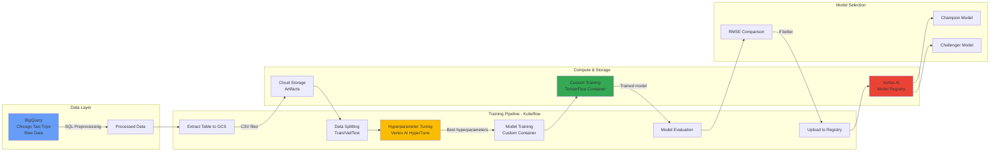
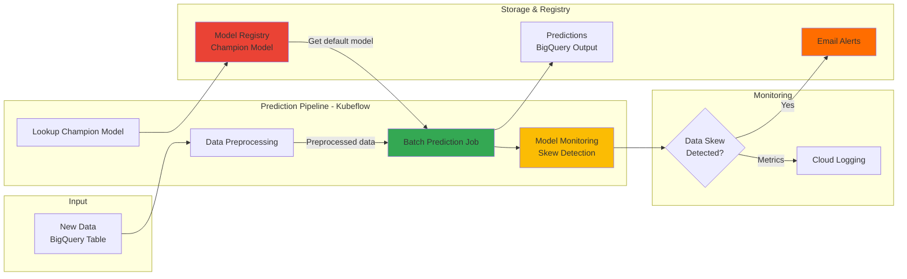
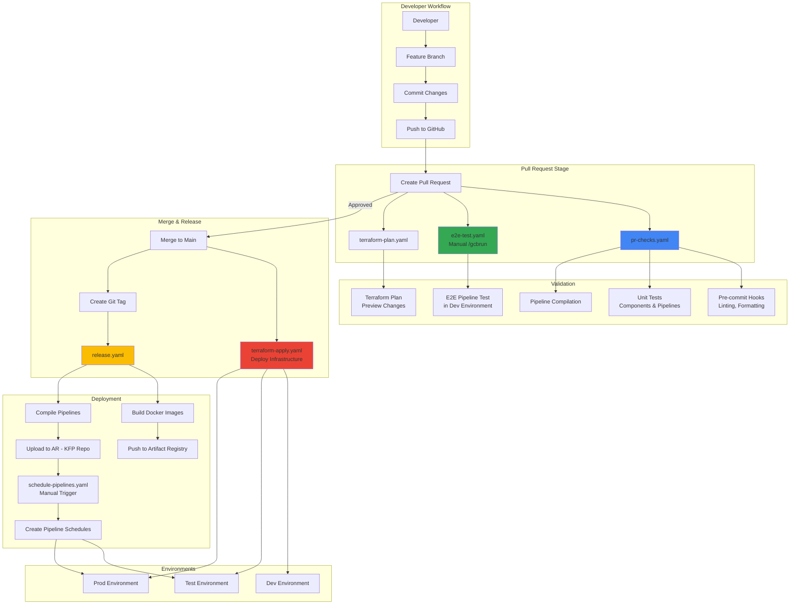
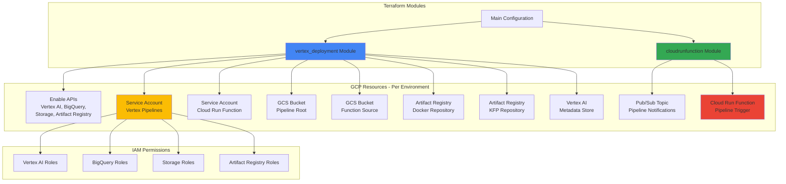
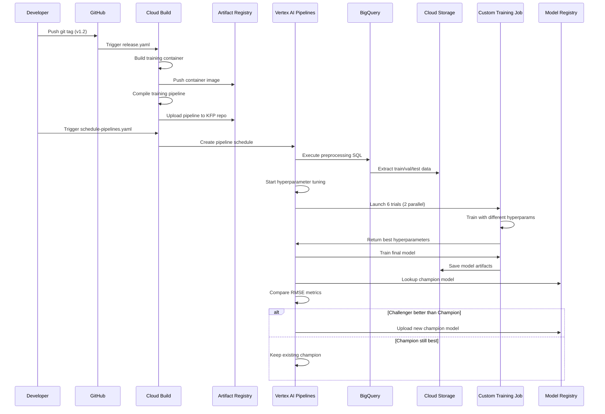
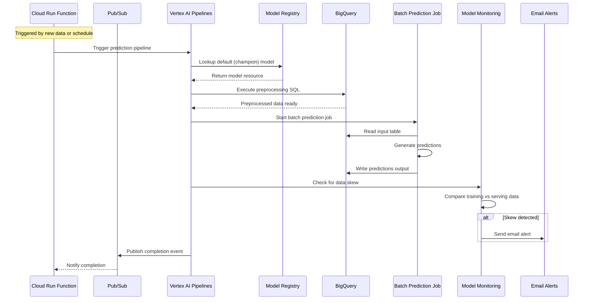
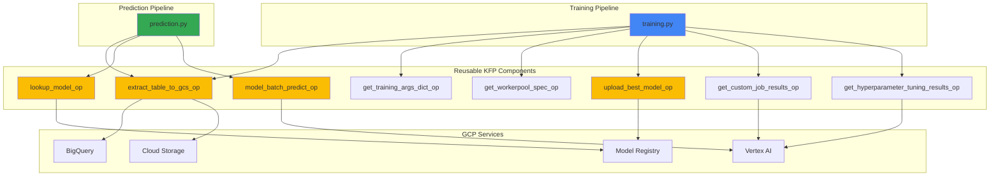
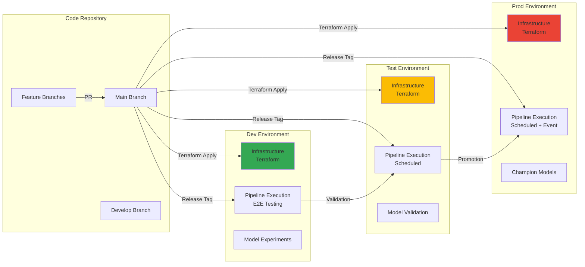

# MLOps Architecture on GCP

This document contains Mermaid diagrams illustrating the architecture of the production-ready MLOps solution.

## Overall System Architecture

```mermaid
graph TB
    subgraph "GitHub Repository"
        Code[Code Repository]
        PR[Pull Requests]
        Release[Git Tags/Releases]
    end

    subgraph "GCP Admin Project - CI/CD"
        CB[Cloud Build]
        CB_PR[PR Checks Trigger]
        CB_E2E[E2E Test Trigger]
        CB_TF_Plan[Terraform Plan Trigger]
        CB_TF_Apply[Terraform Apply Trigger]
        CB_Release[Release Trigger]
        CB_Schedule[Schedule Trigger]
    end

    subgraph "GCP Dev Project"
        Dev_AR[Artifact Registry]
        Dev_Vertex[Vertex AI Pipelines]
        Dev_BQ[BigQuery]
        Dev_GCS[Cloud Storage]
        Dev_Registry[Model Registry]
    end

    subgraph "GCP Test Project"
        Test_AR[Artifact Registry]
        Test_Vertex[Vertex AI Pipelines]
        Test_BQ[BigQuery]
        Test_GCS[Cloud Storage]
        Test_Registry[Model Registry]
    end

    subgraph "GCP Prod Project"
        Prod_AR[Artifact Registry]
        Prod_Vertex[Vertex AI Pipelines]
        Prod_BQ[BigQuery]
        Prod_GCS[Cloud Storage]
        Prod_Registry[Model Registry]
        Prod_CRF[Cloud Run Function]
        Prod_PubSub[Pub/Sub]
    end

    Code --> PR
    PR --> CB_PR
    PR --> CB_TF_Plan
    PR --> CB_E2E
    Code --> Release
    Release --> CB_Release

    CB_PR --> |Pre-commit checks| CB
    CB_E2E --> |Run E2E tests| Dev_Vertex
    CB_TF_Plan --> |Plan infrastructure| CB
    CB_TF_Apply --> |Deploy infrastructure| Dev_AR
    CB_TF_Apply --> |Deploy infrastructure| Test_AR
    CB_TF_Apply --> |Deploy infrastructure| Prod_AR

    CB_Release --> |Build & push images| Dev_AR
    CB_Release --> |Build & push images| Test_AR
    CB_Release --> |Build & push images| Prod_AR

    CB_Schedule --> |Create schedules| Test_Vertex
    CB_Schedule --> |Create schedules| Prod_Vertex

    Prod_CRF --> |Trigger pipelines| Prod_Vertex
    Prod_PubSub --> |Notify completion| Prod_CRF

    style CB fill:#4285f4
    style Dev_Vertex fill:#34a853
    style Test_Vertex fill:#fbbc04
    style Prod_Vertex fill:#ea4335
```

## Training Pipeline Architecture

## Prediction Pipeline Architecture

## CI/CD Pipeline Flow

## Infrastructure Components (Terraform)

## Data Flow - Training Pipeline

## Data Flow - Prediction Pipeline

## Component Interaction

## Multi-Environment Strategy

