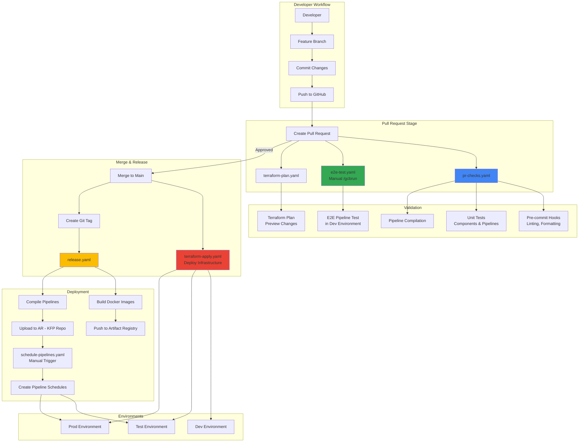
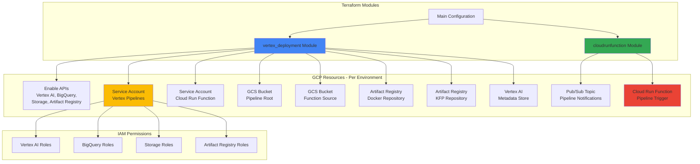

<<<<<<< Updated upstream
=======
# CI/CD Configuration Guide

## Overview

There are 6 CI/CD pipelines:

1. `pr-checks.yaml` - Runs pre-commit checks and unit tests on the custom KFP components, and checks that the ML pipelines (training and prediction) can compile.
1. `e2e-test.yaml` - Runs end-to-end tests of the training and prediction pipeline.
1. `release.yaml` - Compiles training and prediction pipelines, then copies the compiled pipelines to the chosen GCS destination (versioned by git tag).
1. `terraform-plan.yaml` - Checks the Terraform configuration under `terraform/environments/<env>` (e.g. `terraform/environments/test`), and produces a summary of any proposed changes that will be applied on merge to the main branch.
1. `terraform-apply.yaml` - Applies the Terraform configuration under `terraform/environments/<env>` (e.g. `terraform/environments/test`).
1. `schedule-pipelines.yaml` - Schedules the training and prediction pipelines to run at specified intervals.

### CI/CD Pipeline Flow

## Setting up the CI/CD pipelines

### Which project should I use for Cloud Build?

We recommend using a separate `admin` project, since the CI/CD pipelines operate across all the different environments (dev/test/prod).

### Connecting your repository to Google Cloud Build

See the [Google Cloud Documentation](https://cloud.google.com/build/docs/automating-builds/create-manage-triggers) for details on how to link your repository to Cloud Build, and set up triggers.

### Cloud Build service accounts

Your Cloud Build pipelines will need a service account to use.
We recommend the following service accounts to be created in the _admin_ project:

| Service account name | Pipeline(s) | Permissions |
|---|---|---|
| `cloudbuild-prchecks` | `pr-checks.yaml` | `roles/logging.logWriter` (`admin` project) |
| `cloudbuild-e2e-test` | `e2e-test.yaml` | `roles/logging.logWriter` (`admin` project) `roles/storage.admin` (`dev` project) `roles/aiplatform.user` (`dev` project) `roles/iam.serviceAccountUser` (`dev` project) |
| `cloudbuild-release` | `release.yaml` | `roles/logging.logWriter` (`admin` project) `roles/storage.admin` (`dev` project) `roles/storage.admin` (`test` project) `roles/storage.admin` (`prod` project) |
| `terraform-dev` | `terraform-plan.yaml` (dev) `terraform-apply.yaml` (dev) | `roles/logging.logWriter` (`admin` project) `roles/owner` (`dev` project) `roles/storage.admin` (`dev` project) |
| `terraform-test` | `terraform-plan.yaml` (test) `terraform-apply.yaml` (test) | `roles/logging.logWriter` (`admin` project) `roles/owner` (`test` project) `roles/storage.admin` (`test` project) |
| `terraform-prod` | `terraform-plan.yaml` (prod) `terraform-apply.yaml` (prod) | `roles/logging.logWriter` (`admin` project) `roles/owner` (`prod` project) `roles/storage.admin` (`prod` project) |
| `schedule-pipelines-dev` | `schedule-pipelines.yaml` (dev) | `roles/logging.logWriter` (`admin` project) `roles/aiplatform.user` (`dev` project) `roles/storage.admin` (`dev` project) `roles/iam.serviceAccountUser` (`dev` project)  `roles/aiplatform.serviceAgent` (`dev` project)|
| `schedule-pipelines-test` | `schedule-pipelines.yaml` (test) | `roles/logging.logWriter` (`admin` project) `roles/aiplatform.user` (`test` project) `roles/storage.admin` (`test` project) `roles/iam.serviceAccountUser` (`test` project)  `roles/aiplatform.serviceAgent` (`test` project) |
| `schedule-pipelines-prod` | `schedule-pipelines.yaml` (prod) | `roles/logging.logWriter` (`admin` project) `roles/aiplatform.user` (`prod` project) `roles/storage.admin` (`prod` project) `roles/iam.serviceAccountUser` (`prod` project)  `roles/aiplatform.serviceAgent` (`prod` project)|

### Infrastructure Components (Terraform)

The Terraform configuration provisions the following infrastructure components in each environment:

## Recommended triggers

Use the service accounts specified above for these triggers respectively.

### On Pull Request to `main` / `master` branch

Set up a trigger for the `pr-checks.yaml` pipeline.

Set up a trigger for the `e2e-test.yaml` pipeline, and provide substitution values for the following variables:

| Variable | Description | Suggested value |
|---|---|---|
| `_TEST_VERTEX_LOCATION` | The Google Cloud region where you want to run the ML pipelines in the E2E tests as part of the CI/CD pipeline. | Your chosen Google Cloud region |
| `_TEST_VERTEX_PIPELINE_ROOT` | The GCS folder (i.e. path prefix) that you want to use for the pipeline artifacts and for passing data between stages in the pipeline. Used during the pipeline runs in the E2E tests as part of the CI/CD pipeline. | `gs://<Project ID for dev environment>-pl-root` |
| `_TEST_VERTEX_PROJECT_ID` | Google Cloud project ID in which you want to run the ML pipelines in the E2E tests as part of the CI/CD pipeline. | Project ID for the dev environment |
| `_TEST_VERTEX_SA_EMAIL` | Email address of the service account you want to use to run the ML pipelines in the E2E tests as part of the CI/CD pipeline. | `vertex-pipelines@<Project ID for dev environment>.iam.gserviceaccount.com` |
| `_TEST_ENABLE_PIPELINE_CACHING` | Override the default caching behaviour of the ML pipelines. Leave blank to use the default caching behaviour. | `False` |
| `_TEST_BQ_LOCATION` | The location of BigQuery datasets used in training and prediction pipelines. | `US` or `EU` if using multi-region datasets |
| `_IMAGE_NAME` | The name of the Docker image to be built and pushed. | `your-image-name` |

We recommend to enable comment control for this trigger (select `Required` under `Comment Control`). This will mean that the end-to-end tests will only run once a repository collaborator or owner comments `/gcbrun` on the pull request.
This will help to avoid unnecessary runs of the ML pipelines while a Pull Request is still being worked on, as they can take a long time (and can be expensive to run on every pull request!)

Set up three triggers for `terraform-plan.yaml` - one for each of the dev/test/prod environments. Set the Cloud Build substitution variables as follows:

| Environment | Cloud Build substitution variables |
|---|---|
| dev | **\_PROJECT_ID**=\<Google Cloud Project ID for the dev environment> **\_REGION**=\<Google Cloud region to use for the dev environment> **\_ENV_DIRECTORY**=terraform/environments/dev |
| test | **\_PROJECT_ID**=\<Google Cloud Project ID for the test environment> **\_REGION**=\<Google Cloud region to use for the test environment> **\_ENV_DIRECTORY**=terraform/environments/test |
| prod | **\_PROJECT_ID**=\<Google Cloud Project ID for the prod environment> **\_REGION**=\<Google Cloud region to use for the prod environment> **\_ENV_DIRECTORY**=terraform/environments/prod |

### On push of new tag

Set up a trigger for the `release.yaml` pipeline, and provide substitution values for the following variables:

| Variable | Description | Suggested value |
|---|---|---|
| `_DESTINATION_PROJECTS` | The (space separated) Google Cloud project IDs where the compiled pipelines will be copied to - one for each environment (dev/test/prod). | `<Project ID for dev environment> <Project ID for test environment> <Project ID for prod environment>` |
| `_IMAGE_NAME` | The name of the Docker image to be built and pushed. | `your-image-name` |
| `_VERTEX_LOCATION` | The Google Cloud region where the Artifact Registry and Docker repositories are located. | `us-central1` |

### On merge to `main` / `master` branch

Set up three triggers for `terraform-apply.yaml` - one for each of the dev/test/prod environments. Set the Cloud Build substitution variables as follows:

| Environment | Cloud Build substitution variables |
|---|---|
| dev | **\_PROJECT_ID**=\<Google Cloud Project ID for the dev environment> **\_REGION**=\<Google Cloud region to use for the dev environment> **\_ENV_DIRECTORY**=terraform/environments/dev |
| test | **\_PROJECT_ID**=\<Google Cloud Project ID for the test environment> **\_REGION**=\<Google Cloud region to use for the test environment> **\_ENV_DIRECTORY**=terraform/environments/test |
| prod | **\_PROJECT_ID**=\<Google Cloud Project ID for the prod environment> **\_REGION**=\<Google Cloud region to use for the prod environment> **\_ENV_DIRECTORY**=terraform/environments/prod |

### Manual from `main` / `master` branch

Set up three triggers for `schedule-pipelines.yaml` - one for each of the dev/test/prod environments. Set the Cloud Build substitution variables as follows:
| Environment | Cloud Build substitution variables |
|---|---|
| dev | **\_TEST_VERTEX_PROJECT_ID**=\<Google Cloud Project ID for the dev environment> **\_TEST_VERTEX_LOCATION**=\<Google Cloud region to use for the dev environment> **\_ENV**=dev **\_TEST_VERTEX_PIPELINE_ROOT**=\<The GCS folder (i.e. path prefix) that you want to use for the pipeline artifacts and for passing data between stages in the pipeline.`gs://<Project ID for dev environment>-pl-root`> **\_TEST_VERTEX_SA_EMAIL**=<\Email address of the service account you want to use to run the ML pipeline `vertex-pipelines@<Project ID for dev environment>.iam.gserviceaccount.com`> **\_TRAINING_TAG_NAME**=<\tag of KPF training pipeline release to run on a schedule i.e v1.2.0>  **\_TEST_ENABLE_PIPELINE_CACHING**=<\Override the default caching behaviour of the ML pipelines. Leave blank to use the default caching behaviour.>  **\_TEST_TIMESTAMP**=<\Set timestamp to select data for experiment repetability default is "">  **\_PREDICTION_TAG_NAME**=<\tag of KPF prediction pipeline release to run on a schedule i.e v1.2.0>  **\_TEST_BQ_LOCATION**=<\The location of BigQuery datasets used in training and prediction pipelines.>  **\_TEST_USE_LATEST_DATA**=<\ If set to true, the pipeline will use the latest fresh available data to train/predict on >  |
| test | **\_TEST_VERTEX_PROJECT_ID**=\<Google Cloud Project ID for the test environment> **\_TEST_VERTEX_LOCATION**=\<Google Cloud region to use for the test environment> **\_ENV**=test **\_TEST_VERTEX_PIPELINE_ROOT**=\<The GCS folder (i.e. path prefix) that you want to use for the pipeline artifacts and for passing data between stages in the pipeline.`gs://<Project ID for test environment>-pl-root`> **\_TEST_VERTEX_SA_EMAIL**=<\Email address of the service account you want to use to run the ML pipeline `vertex-pipelines@<Project ID for test environment>.iam.gserviceaccount.com`> **\_TRAINING_TAG_NAME**=<\tag of KPF training pipeline release to run on a schedule i.e v1.2.0>  **\_TEST_ENABLE_PIPELINE_CACHING**=<\Override the default caching behaviour of the ML pipelines. Leave blank to use the default caching behaviour.>  **\_TEST_TIMESTAMP**=<\Set timestamp to select data for experiment repetability default is "">  **\_PREDICTION_TAG_NAME**=<\tag of KPF prediction pipeline release to run on a schedule i.e v1.2.0>  **\_TEST_BQ_LOCATION**=<\The location of BigQuery datasets used in training and prediction pipelines.>  **\_TEST_USE_LATEST_DATA**=<\ If set to true, the pipeline will use the latest fresh available data to train/predict on >  |
| prod | **\_TEST_VERTEX_PROJECT_ID**=\<Google Cloud Project ID for the prod environment> **\_TEST_VERTEX_LOCATION**=\<Google Cloud region to use for the prod environment> **\_ENV**=test **\_TEST_VERTEX_PIPELINE_ROOT**=\<The GCS folder (i.e. path prefix) that you want to use for the pipeline artifacts and for passing data between stages in the pipeline.`gs://<Project ID for prod environment>-pl-root`> **\_TEST_VERTEX_SA_EMAIL**=<\Email address of the service account you want to use to run the ML pipeline `vertex-pipelines@<Project ID for prod environment>.iam.gserviceaccount.com`> **\_TRAINING_TAG_NAME**=<\tag of KPF training pipeline release to run on a schedule i.e v1.2.0>  **\_TEST_ENABLE_PIPELINE_CACHING**=<\Override the default caching behaviour of the ML pipelines. Leave blank to use the default caching behaviour.>  **\_TEST_TIMESTAMP**=<\Set timestamp to select data for experiment repetability default is "">  **\_PREDICTION_TAG_NAME**=<\tag of KPF prediction pipeline release to run on a schedule i.e v1.2.0>  **\_TEST_BQ_LOCATION**=<\The location of BigQuery datasets used in training and prediction pipelines.>  **\_TEST_USE_LATEST_DATA**=<\ If set to true, the pipeline will use the latest fresh available data to train/predict on >  | |
>>>>>>> Stashed changes
