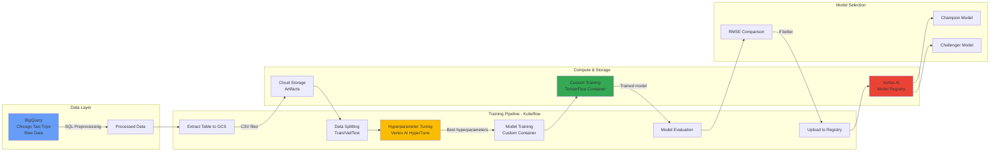
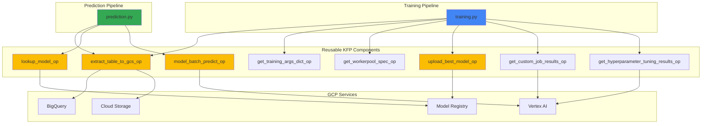
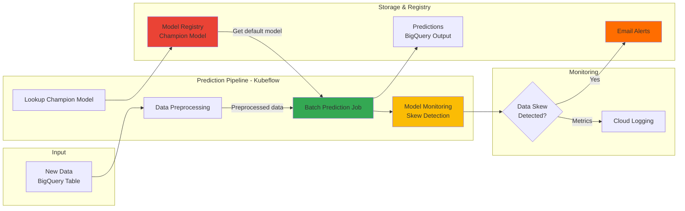

## Training Pipeline Overview

This repository includes an example ML training pipeline that demonstrates a comprehensive end-to-end process for training a model using Google Cloud's Vertex AI. The pipeline is defined using Kubeflow Pipelines (KFP) and leverages components such as BigQuery, custom training containers, and hyperparameter tuning.

### Training Pipeline Architecture



### Key Pipeline Steps

1. **Data Preprocessing**:
   - The pipeline begins by preprocessing raw data stored in BigQuery. The data is cleaned and prepared for model training, using SQL queries defined in the `queries` directory.

2. **Data Splitting**:
   - The preprocessed data is split into training, validation, and test sets using repeatable data splitting queries. These splits are essential for training and evaluating the model effectively.

3. **Data Extraction**:
   - The split datasets are extracted from BigQuery and stored in Google Cloud Storage (GCS). This ensures that the data is readily accessible for the training process.

4. **Hyperparameter Tuning**:
   - The pipeline includes a hyperparameter tuning step, which utilizes Vertex AI's Hyperparameter Tuning Job. Key hyperparameters such as learning rate and batch size are tuned to optimize model performance. The tuning process is defined by the `PARAMETER_SPEC` and `METRIC_SPEC`, and the results are used to configure the final training job.

5. **Model Training**:
   - Once the optimal hyperparameters are identified, the model is trained using a custom container image specified in the `Dockerfile`. The training job leverages the tuned hyperparameters to achieve the best possible model performance.

6. **Model Evaluation and Upload**:
   - After training, the model is evaluated against a champion model based on a primary metric (e.g., root mean squared error). The best-performing model is then uploaded to the Model Registry in Vertex AI, ready for deployment.

### Running the Training Pipeline

To run the training pipeline, you need to configure the environment and build the necessary containers:

1. **Set up your environment**:
   - Ensure you have the necessary environment variables set, such as `VERTEX_PROJECT_ID`, `VERTEX_LOCATION`, `IMAGE_NAME`, and `IMAGE_TAG`.

2. **Build and push the training container**:
   - Use the following command to build and push the container image for model training:

   ```bash
   make build
   ```

3. **Compile and run the pipeline**:
   - Compile the pipeline and run it in Vertex AI:

   ```bash
   make training
   ```

### Component Interaction

The training and prediction pipelines leverage reusable Kubeflow components that interact with various GCP services:



## Prediction Pipeline Overview

The prediction pipeline performs batch inference using the champion model from the Model Registry. It includes data preprocessing, batch prediction, and model monitoring capabilities.

### Prediction Pipeline Architecture



### Key Prediction Steps

1. **Model Lookup**:
   - The pipeline retrieves the default (champion) model from Vertex AI Model Registry.

2. **Data Preprocessing**:
   - New data is preprocessed using the same SQL queries used during training to ensure consistency.

3. **Batch Prediction**:
   - The Vertex AI Batch Prediction Job processes the preprocessed data using the champion model.
   - Predictions are written directly to a BigQuery output table.

4. **Model Monitoring**:
   - The pipeline monitors for training-serving skew by comparing data distributions.
   - Email alerts are sent if skew thresholds are exceeded.

### Running the Prediction Pipeline

To run the prediction pipeline:

```bash
make prediction
```
