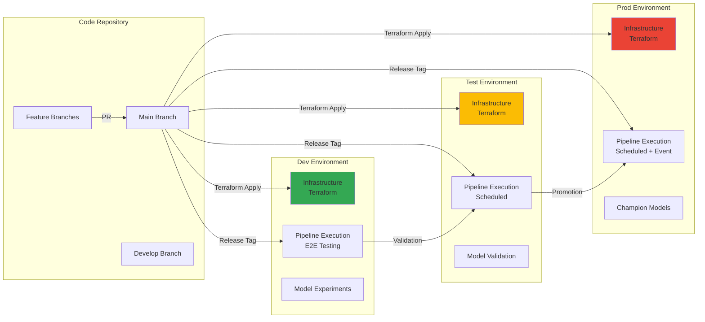
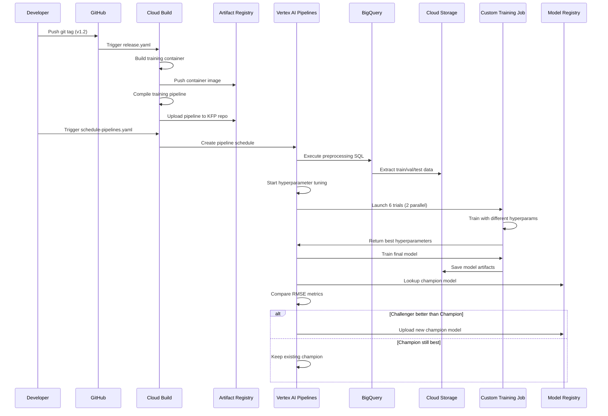

# Running ML pipelines in production

This document outlines the process of deploying and managing ML pipelines in a production environment.

## Pre-requisites

-   GCP environment configured as per the [README](../README.md)
-   Forked repository or used as a template
-   CI/CD configured (see [cloudbuild/README.md](cloudbuild/README.md))
-   BigQuery dataset access configured
-   Local environment setup (see [README.md](/README.md#local-setup))
-   **Google Cloud SDK installed and configured**

## Configuring the Google Cloud SDK

Before interacting with Google Cloud services from your terminal, you need to authenticate and configure the Google Cloud SDK.

1.  **Install the Google Cloud SDK:** Follow the instructions at [https://cloud.google.com/sdk/docs/install](https://cloud.google.com/sdk/docs/install) to install the SDK on your local machine.

2.  **Initialize the SDK:**
    ```bash
    gcloud init
    ```
    This command will guide you through the following steps:
    -   Choose a Google Cloud account to use.
    -   Select a Google Cloud project.

3.  **Authenticate with your Google Cloud account:** If you are not already logged in, you may be prompted to authenticate. Follow the instructions in the browser to grant the SDK access to your Google Cloud account.

4.  **Set the default project:**
    ```bash
    gcloud config set project YOUR_PROJECT_ID
    ```
    Replace `YOUR_PROJECT_ID` with the ID of your Google Cloud project.

5.  **Set the default region/zone (optional):**
    ```bash
    gcloud config set compute/region YOUR_REGION
    gcloud config set compute/zone YOUR_ZONE
    ```
    Replace `YOUR_REGION` and `YOUR_ZONE` with the appropriate values for your project.

After completing these steps, your terminal will be configured to interact with your Google Cloud project.

## Multi-Environment Strategy

This project uses a three-tier environment strategy for safe deployment:



## Making changes to the pipelines

1.  Create a feature branch: `git checkout -b my-feature-branch`
2.  Modify pipeline code (e.g., `pipelines/src/pipelines/training.py`)
3.  Commit changes
4.  Push branch to GitHub
5.  Create a Pull Request (PR)

The PR triggers CI (`pr-checks.yaml`) for code checks, unit tests, and pipeline compilation. End-to-end tests can be triggered with the `/gcbrun` command. After review, merge the PR.

| :bulb: Remember    |
| :-------------------|
| Update unit tests to reflect code changes |

| :exclamation: Important |
| :-----------------------|
| Ensure pipeline parameters are correctly configured in `pipeline.py` for the cloud environment. Parameters can be inherited from environment variables in `env.sh` or Cloud Build triggers. |

## Creating a release

To deploy your ML pipelines to test and production, [create a release](https://docs.github.com/en/repositories/releasing-projects-on-github/managing-releases-in-a-repository#creating-a-release).

Creating a release tag triggers the `release.yaml` pipeline. This pipeline builds container images, compiles pipelines, and uploads them to Artifact Registry.

#### Example

-   `release.yaml` CI/CD pipeline variables:
    -   `_PIPELINE_PUBLISH_AR_PATHS` = `https://<GCP region>-kfp.pkg.dev/<Project ID of dev project>/vertex-pipelines https://<GCP region>-kfp.pkg.dev/<Project ID of test project>/vertex-pipelines https://<GCP region>-kfp.pkg.dev/<Project ID of prod project>/vertex-pipelines`
-   Release tag: `v1.2`

Compiled training pipeline locations:

-   `https://<GCP region>-kfp.pkg.dev/<Project ID of dev project>/vertex-pipelines/train-pipeline/v1.2`
-   `https://<GCP region>-kfp.pkg.dev/<Project ID of test project>/vertex-pipelines/train-pipeline/v1.2`
-   `https://<GCP region>-kfp.pkg.dev/<Project ID of prod project>/vertex-pipelines/train-pipeline/v1.2`

Compiled prediction pipeline locations:

-   `https://<GCP region>-kfp.pkg.dev/<Project ID of dev project>/vertex-pipelines/prediction-pipeline/v1.2`
-   `https://<GCP region>-kfp.pkg.dev/<Project ID of test project>/vertex-pipelines/prediction-pipeline/v1.2`
-   `https://<GCP region>-kfp.pkg.dev/<Project ID of prod project>/vertex-pipelines/prediction-pipeline/v1.2`

## Deploying a release

After creating a release and copying the compiled pipelines, schedule them to run. This project uses manually triggered `aiplatform.pipeline_job_schedules.PipelineJobSchedule` via Cloud Build and a Cloud Run function for continuous training.

### Deployment Workflow

The following diagram shows the complete workflow from code changes to production deployment:



### Test Environment

1.  Go to the Cloud Build dashboard.
2.  Find `schedule-pipelines.yaml`.
3.  Manually trigger the job with `ENVIRONMENT=test`. This creates the pipeline job schedule using `pipelines/src/pipelines/utils/schedule_pipeline.py`.
4.  Verify the schedule in the Vertex AI Pipelines dashboard.

### Production Environment

1.  Go to the Cloud Build dashboard.
2.  Find `schedule-pipelines.yaml`.
3.  Manually trigger the job with `ENVIRONMENT=prod`.
4.  Verify the schedule in the Vertex AI Pipelines dashboard.

### Cloud Run Function

The `cloudrunfunction` Terraform module deploys a Cloud Run function for continuous training, triggered by new data in BigQuery. It also uses a Cloud Pub/Sub topic.

-   Function code: `terraform/modules/cloudrunfunction/src/main.py`
-   Configuration: `PIPELINE_CONFIG` environment variable (JSON string)
-   Uses `kfp.registry.RegistryClient` to resolve the pipeline template URI.
-   Submits the pipeline job to Vertex AI.
-   Subscribes to a Cloud Pub/Sub topic to trigger the prediction pipeline.

To deploy the Cloud Run function:

```terraform
module "cloudrunfunction" {
  source = "./modules/cloudrunfunction"

  project_id  = var.project_id
  location      = var.location
  sa_email      = var.sa_email
  pipeline_config = jsonencode({
    type                    = "training"
    display_name            = "my-pipeline"
    bq_location             = "US"
    use_latest_data         = true
    timestamp               = ""
    training_template_path = "https://us-central1-kfp.pkg.dev/your-project/vertex-pipelines/train-pipeline/latest"
    prediction_template_path = "https://us-central1-kfp.pkg.dev/your-project/vertex-pipelines/predict-pipeline/latest"
    pubsub_topic_name       = "training-complete"
  })
  dataset_id = var.dataset_id
  table_id   = var.table_id
}
```

## Monitoring

-   Use Cloud Monitoring and Cloud Logging.
-   Set up alerts.

## Rollback

-   Update the `template_path` in `schedule-pipelines.yaml` and re-trigger the Cloud Build job.

## Best Practices

-   **Infrastructure as Code (IaC)**
-   **Continuous Integration/Continuous Deployment (CI/CD)**
-   **Monitoring and Alerting**
-   **Version Control**
-   **Immutable Infrastructure**
